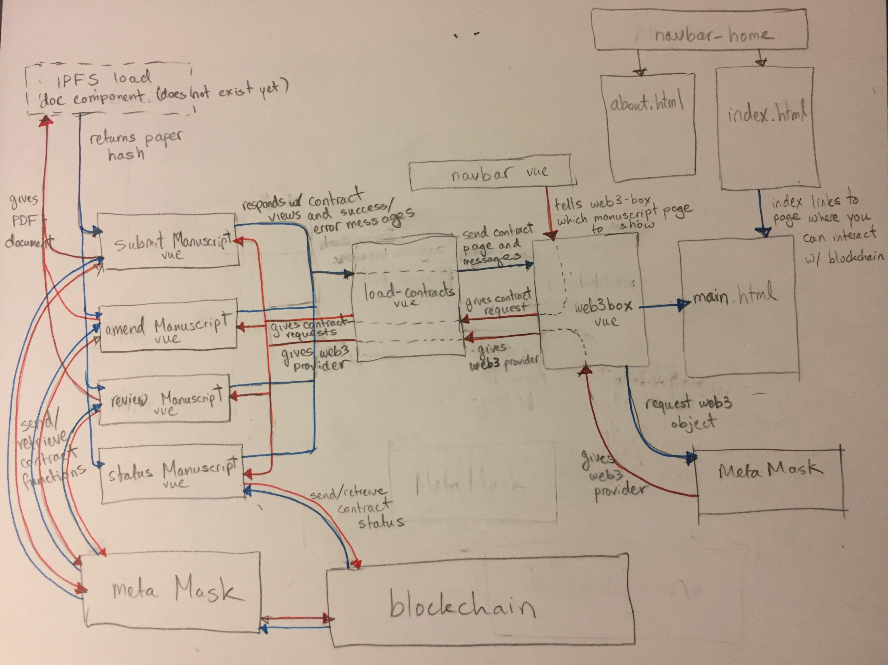

  

## How to setup for development

- `$ npm install`
    - Installs all the packages you need to run, including webpack. See a list of what will be installed in `package.json`.
- `$ npm run build`
    - Builds the webpack bundle of all the javascript. Configuration for building in `webpack.config.js`. All you need to do is include `dist/build.js` in any html file.
- Establish the default connection to a blockchain by editing `truffle.js` to point to where your testRPC is running.
- `$ npm install -g truffle`
    - You may need to use sudo to install it. 
- `$ npm install -g ganache-cli` and then simply `$ ganache-cli` to run it.
    - This is to run a blockchain locally for testing.
    - The default port it runs on is 8545.
- `$ truffle compile && truffle migrate`
    - This will compile the contracts written in solidity into a form such that they interact with javascript. `truffle migrate` then migrates your contract to the blockchain.
- `$ npm run dev`
    - Launches the dev server on port 4000.

## How to modify

- `main.html` is where all the magic happens. It load Web3Box, which is the central controller for find, loading, and manipulating ethereum contracts. 
- Web3box finds the MetaMask instance (or any other web3 instance the user is running) and hands it to the contracts to use. It also holds the navbar, the page header, and loads contracts from TruffleContract.
    - LoadContracts vue takes the JSON of your contracts from `build/contracts` and puts them into an easy to use TruffleContract. It also passes the web3 instance from Web3Box to each of the specific contract components.
    - submitContract.vue, statusContract.vue, amendContract.vue, and commentsContract.vue are components that interface between the specific contract code and the user.

- Each Contract component has a `<script>` tag that loads the javascript which does all the heavy lifting. It also has a `<template>` tag that describes how the page looks like in html. All the components are located in `src/components`. 

Here is a picture of the site outline so far:

## Inspiration

Peer-review is critical to modern science, engineering, and healthcare
endeavors. However, the system for implementing this process has lagged behind
and results in expensive costs for publishing and accessing material, long turn
around times reminiscent of snail-mail, and shockingly opaque editorial
practices. Astronomy, Physics, Mathematics, and Engineering using a "pre-print
server" ([arXiv](https://arxiv.org)) which was the early internet's improvement
upon snail-mailing articles to researchers around the world. This pre-print
server is maintained by a single University, and is constantly requesting
donations to keep up the servers and maintenance. While researchers widely
acknowledge the importance of the pre-print server, there is no peer-review
incorporated, and none planned due to technical reasons. Thus, researchers are
stuck with spending >$1000 per paper to be published in Journals, all the while
individual article access can cost as high as $32 per paper!
([source](https://www.nature.com/subscriptions/purchasing.html)). For reference,
a single PhD thesis can contain >150 references, or essentially cost $4800 if
purchased individually.

The recent advance of blockchain and smart contract technology
([Ethereum](https://www.ethereum.org/)) coupled with decentralized
file sharing networks ([InterPlanetaryFileSystem](https://ipfs.io))
naturally lead us to believe that archaic journals and editors could
be bypassed. We created our manuscript distribution and reviewing
platform based on the arXiv, but in a completely decentralized manner.
Users utilize, maintain, and grow the network of scholarship by simply
running a simple program and web interface.

## What it does

arXain is a Dapp that deals with all the aspects of a peer-reviewed journal service.
An author (wallet address) will come with a bomb-ass paper they wrote.
In order to "upload" their paper to the blockchain, they will first
need to add their file/directory to the IPFS distributed file system. This will
produce a unique reference number (DOI is currently used in journals)
and hash corresponding to the current paper file/directory.

The author can then use their address on the Ethereum network to create a new contract
to submit the paper using this reference number and paperID. In this way, there will
be one paper per contract. The only other action the
author can make to that paper is submitting another draft.

Others can review and comment on papers, but an address can not comment/review
its own paper. The reviews are rated on a "work needed", "acceptable" basis
and the reviewer can also upload an IPFS hash of their comments file/directory.
Protection is also built in such that others can not submit revisions of the
original author's paper.

The blockchain will have a record of the initial paper submitted, revisions made
by the author, and comments/reviews made by peers. The beauty of all of this is
one can see the full transaction histories and reconstruct the full evolution of
the document. One can see the initial draft, all suggestions from reviewers,
how many reviewers, and how many of them think the final draft is reasonable.

## How we built it
There are 2 main back-end components, the IPFS file hosting service
and the Ethereum blockchain smart contracts. They are bridged together
with ([MetaMask](https://metamask.io/)), a tool for connecting
the distributed blockchain world, and by extension the distributed
papers, to a web browser.

We designed smart contracts in Solidity. The IPFS interface was built using a
combination of Bash, HTML, and a lot of regex!
. Then we connected the IPFS distributed net with the Ethereum Blockchain using
MetaMask and Javascript.

## Challenges we ran into

On the Ethereum side, setting up the Truffle Ethereum framework and test
networks were challenging. Learning the limits of Solidity and constantly
reminding ourselves that we had to remain decentralized was hard!
The IPFS side required a lot of clever regex-ing. Ensuring that public access
to researchers manuscript and review history requires other proper identification
and distribution on the network.

The hardest part was using MetaMask and Javascript to call our contracts
and connect the blockchain to the browser. We struggled for about hours
trying to get javascript to deploy a contract on the blockchain. We were all
new to functional programming.

## Accomplishments that we're proud of

Closing all the curly bois and close parentheticals in javascript.
Learning a whole lot about the blockchain and IPFS. We went into this
weekend wanting to learning about how the blockchain worked, and came out
learning about Solidity, IPFS, Javascript, and a whole lot more. You can
see our "genesis-paper"on an IPFS gateway (a bridge between HTTP and IPFS) here

## What we learned

We went into this with knowledge that was a way to write smart contracts,
that IPFS existed, and minimal Javascript.

We learned intimate knowledge of setting up Ethereum Truffle frameworks,
Ganache, and test networks along with the development side of Ethereum
Dapps like the Solidity language, and javascript tests with the Mocha framework.

We learned how to navigate the filespace of IPFS, hash and and organize directories,
and how the file distribution works on a P2P swarm.

## What's next for arXain

With some more extensive testing, arXain is ready for the Ropsten test network
_at the least_. If we had a little more ETH to spare, we would consider launching
our Dapp on the Main Network. arXain PDFs are already on the IPFS swarm and can
be accessed by any IPFS node.
